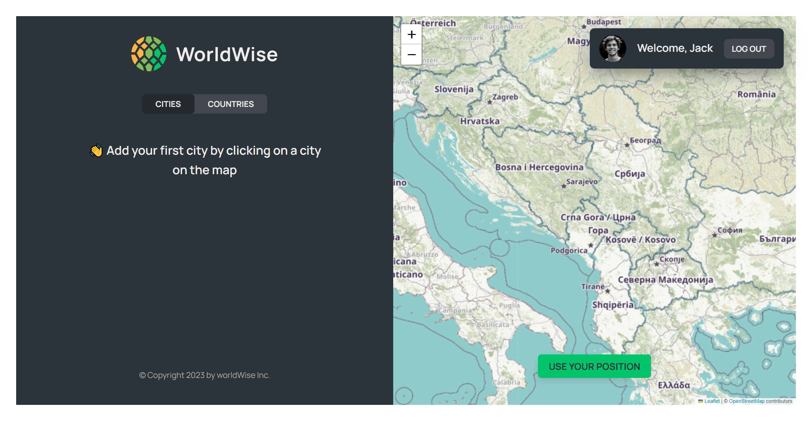

# WorldWise

A world map that tracks your footsteps into every city you can think of.

You can view the project live here:
[WorldWise](https://world-wise-world-map.netlify.app/)

---

### Table of Contents

- [Description](#description)
- [Getting Started](#getting-started)
- [References](#references)

---

## Description

- When we enter the application, we have several pages. At the beginning, you need to log in to enter the application.
- After logging in, when we click on any place on the map, a form window appears.
- When we submit the form, the location where we have been, or plan to go (certain city) is stored in a json file, and that location of the city is automatically displayed on the map.

### Technologies

- React
- Leaflet
- React Router

[Back To The Top](#worldwise)

---

## Getting Started

To start the project, it is necessary to download the files from the github repository and after that run this commands:
 `'npm i'`   `'npm run dev'`

[Back To The Top](#worldwise)

---

## References

This is Leaflet Library through which I displayed the map: [Leaflet Library](https://leafletjs.com/)

I made this project with the help of Jonas Schmedtmann in the React course: [React course](https://www.udemy.com/course/the-ultimate-react-course/)

[Back To The Top](#worldwise)
